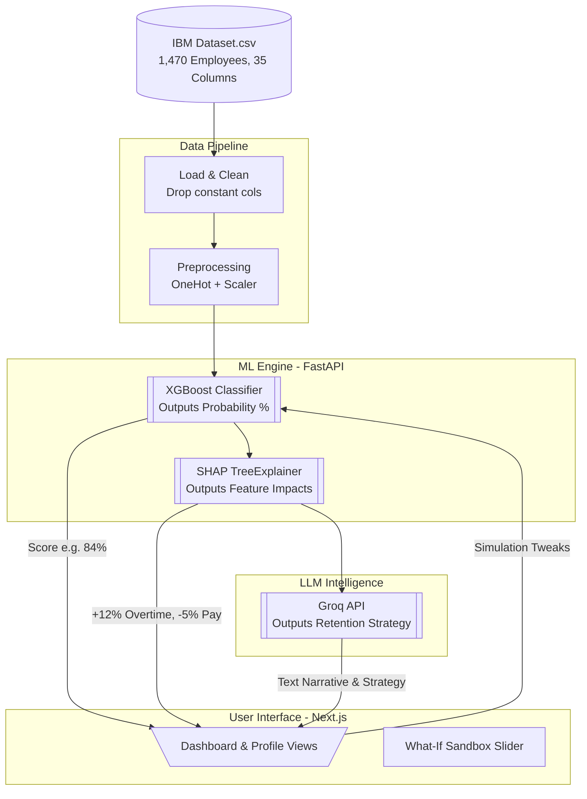

# Generative HR Attrition Insight Reporter: Full System Replication Guide

This document is a comprehensive, step-by-step technical blueprint. It is designed so that *any* AI Agent or software engineering team can read it and perfectly replicate the Generative HR Attrition Insight Reporter system from scratch.

**Data Source**: [IBM HR Analytics Employee Attrition & Performance Dataset](https://www.kaggle.com/datasets/pavansubhasht/ibm-hr-analytics-attrition-dataset) — 1,470 employees, 35 columns. The dataset is pre-loaded at `IBM Dataset.csv` in the project root.

---

## Part 1: System Overview & Architecture Diagram

### The Goal
Build a 3-tier system that takes the IBM HR Attrition dataset, predicts if an employee will leave (using XGBoost), explains exactly *why* mathematically (using SHAP), and generates an actionable retention strategy in plain English (using the Groq LLM API).

### Architecture Flow



### Essential Tech Stack
| Layer | Technology | Purpose |
|:---|:---|:---|
| **Language** | Python 3.10+ | All backend logic |
| **Data Processing** | `pandas`, `numpy` | DataFrame operations |
| **ML Model** | `xgboost` | Binary classification for attrition prediction |
| **Explainability** | `shap` | SHAP TreeExplainer for feature importance |
| **Preprocessing** | `scikit-learn` | `ColumnTransformer`, `StandardScaler`, `OneHotEncoder`, `LabelEncoder` |
| **Serialization** | `joblib` | Persist trained model & preprocessor to disk |
| **API Server** | `fastapi`, `uvicorn` | Async REST API |
| **Validation** | `pydantic` | Request/Response schemas |
| **GenAI** | `groq` (Python SDK) | LLM inference via Groq cloud |
| **Frontend** | Next.js 14+ (App Router) | React-based dashboard |
| **Styling** | `tailwindcss` | Utility-first CSS |
| **Charts** | `recharts` | SHAP visualizations, risk gauges |

---

## Part 2: Project Directory Structure

```
HR/
├── IBM Dataset.csv                 # Source dataset (Kaggle)
├── Technical Overview.md           # This file
├── backend/
│   ├── .env                        # Environment variables (GROQ_API_KEY)
│   ├── requirements.txt            # Python dependencies
│   ├── main.py                     # FastAPI app entry point, CORS, routers
│   ├── config.py                   # Settings loaded from .env via pydantic-settings
│   ├── database.py                 # Data loading from IBM Dataset.csv and query helpers
│   ├── models/
│   │   └── schemas.py              # Pydantic request/response models
│   ├── ml/
│   │   ├── train_pipeline.py       # Model training & export script
│   │   ├── predictor.py            # Runtime inference + SHAP explanation logic
│   │   ├── xgb_model.joblib        # Serialized trained XGBoost model
│   │   └── preprocessor.joblib     # Serialized sklearn ColumnTransformer
│   ├── services/
│   │   ├── ai_service.py           # Groq LLM prompt construction & invocation
│   │   └── dashboard_service.py    # Aggregation logic for dashboard KPIs
│   ├── routers/
│   │   ├── employees.py            # /api/employees routes
│   │   └── dashboard.py            # /api/dashboard routes
│   └── tests/
│       ├── test_predictor.py       # Unit tests for ML inference
│       ├── test_endpoints.py       # Integration tests for API routes
│       └── test_ai_service.py      # Mocked Groq response tests
│
├── frontend/
│   ├── package.json
│   ├── next.config.js
│   ├── tailwind.config.ts
│   ├── .env.local                  # NEXT_PUBLIC_API_URL=http://localhost:8000
│   ├── src/
│   │   ├── app/
│   │   │   ├── layout.tsx          # Root layout (fonts, global styles)
│   │   │   ├── page.tsx            # Dashboard home
│   │   │   └── employees/
│   │   │       ├── page.tsx        # Employee directory
│   │   │       └── [id]/
│   │   │           └── page.tsx    # Individual risk profile
│   │   ├── components/
│   │   │   ├── KPICard.tsx         # Reusable metric card
│   │   │   ├── RiskGauge.tsx       # Circular risk score gauge
│   │   │   ├── SHAPChart.tsx       # Horizontal bar chart for SHAP values
│   │   │   ├── InsightPanel.tsx    # Renders Groq narrative text
│   │   │   ├── SimulationSandbox.tsx # What-If sliders + live score
│   │   │   ├── EmployeeTable.tsx   # Data grid with filters
│   │   │   └── DeptRiskChart.tsx   # Bar chart for department risks
│   │   └── lib/
│   │       └── api.ts              # Centralized fetch/axios client
│   └── public/
│       └── ...                     # Static assets
```

---

## Part 3: Environment Configuration

### Backend `.env`
```env
# Required
GROQ_API_KEY=gsk_xxxxxxxxxxxxxxxxxxxx
GROQ_MODEL=llama3-8b-8192

# Optional (defaults shown)
DATA_PATH=../IBM Dataset.csv
MODEL_PATH=ml/xgb_model.joblib
PREPROCESSOR_PATH=ml/preprocessor.joblib
CORS_ORIGINS=http://localhost:3000
```

### Backend `config.py`
```python
from pydantic_settings import BaseSettings

class Settings(BaseSettings):
    groq_api_key: str
    groq_model: str = "llama3-8b-8192"
    data_path: str = "../IBM Dataset.csv"
    model_path: str = "ml/xgb_model.joblib"
    preprocessor_path: str = "ml/preprocessor.joblib"
    cors_origins: str = "http://localhost:3000"

    class Config:
        env_file = ".env"

settings = Settings()
```

### Frontend `.env.local`
```env
NEXT_PUBLIC_API_URL=http://localhost:8000
```

---

## Part 4: IBM Dataset Schema (Exact Columns from CSV)

The IBM HR Analytics dataset has **35 columns** and **1,470 rows**. The `Attrition` column is the target variable (Yes/No).

### 4.1 Columns to DROP Before Training
These columns are constant across all rows or are simple identifiers. They provide zero predictive signal.

| Column | Reason to Drop |
|:---|:---|
| `EmployeeNumber` | Unique ID — no predictive value |
| `EmployeeCount` | Always = 1 for all rows |
| `Over18` | Always = "Y" for all rows |
| `StandardHours` | Always = 80 for all rows |

### 4.2 Usable Features for ML (30 Columns After Dropping)
*After removing the 4 constant/ID columns and the `Attrition` target, 30 features remain.*

| # | Category | Column Name | Type | Range / Values | ML Notes |
|:--|:---|:---|:---|:---|:---|
| 1 | Demographics | `Age` | Int | 18 - 60 | Continuous, scale |
| 2 | | `Gender` | Cat | Male, Female | OneHotEncode |
| 3 | | `MaritalStatus` | Cat | Single, Married, Divorced | OneHotEncode |
| 4 | Education | `Education` | Ordinal | 1 (Below College) → 5 (Doctorate) | Treat as numeric |
| 5 | | `EducationField` | Cat | Life Sciences, Medical, Marketing, Technical Degree, HR, Other | OneHotEncode |
| 6 | Job | `Department` | Cat | Sales, Research & Development, Human Resources | OneHotEncode |
| 7 | | `JobRole` | Cat | 9 distinct roles (Sales Executive, Research Scientist, etc.) | OneHotEncode |
| 8 | | `JobLevel` | Ordinal | 1 → 5 | Treat as numeric |
| 9 | | `BusinessTravel` | Cat | Non-Travel, Travel_Rarely, Travel_Frequently | OneHotEncode |
| 10 | | `OverTime` | Binary | Yes, No | **Top predictor** — LabelEncode to 1/0 |
| 11 | | `DistanceFromHome` | Int | 1 - 29 | Continuous, scale |
| 12 | Comp | `MonthlyIncome` | Int | 1,009 - 19,999 | Continuous, scale |
| 13 | | `DailyRate` | Int | 102 - 1,499 | Continuous, scale |
| 14 | | `HourlyRate` | Int | 30 - 100 | Continuous, scale |
| 15 | | `MonthlyRate` | Int | 2,094 - 26,999 | Continuous, scale |
| 16 | | `PercentSalaryHike` | Int | 11 - 25 | Continuous, scale |
| 17 | | `StockOptionLevel` | Ordinal | 0 → 3 | Treat as numeric |
| 18 | Tenure | `TotalWorkingYears` | Int | 0 - 40 | Continuous, scale |
| 19 | | `YearsAtCompany` | Int | 0 - 40 | Continuous, scale |
| 20 | | `YearsInCurrentRole` | Int | 0 - 18 | Continuous, scale |
| 21 | | `YearsSinceLastPromotion` | Int | 0 - 15 | **Top predictor** |
| 22 | | `YearsWithCurrManager` | Int | 0 - 17 | Continuous, scale |
| 23 | | `NumCompaniesWorked` | Int | 0 - 9 | Continuous, scale |
| 24 | | `TrainingTimesLastYear` | Int | 0 - 6 | Continuous, scale |
| 25 | Satisfaction | `JobSatisfaction` | Ordinal | 1 (Low) → 4 (Very High) | Treat as numeric |
| 26 | | `EnvironmentSatisfaction` | Ordinal | 1 → 4 | Treat as numeric |
| 27 | | `RelationshipSatisfaction` | Ordinal | 1 → 4 | Treat as numeric |
| 28 | | `WorkLifeBalance` | Ordinal | 1 (Bad) → 4 (Best) | Treat as numeric |
| 29 | | `JobInvolvement` | Ordinal | 1 → 4 | Treat as numeric |
| 30 | | `PerformanceRating` | Ordinal | 3 or 4 (in this dataset) | Treat as numeric |

### 4.3 Target Column
| Column | Type | Values | Notes |
|:---|:---|:---|:---|
| `Attrition` | Binary | "Yes" (237 rows, ~16%) / "No" (1,233 rows, ~84%) | Used ONLY during model training. Class-imbalanced. |

### 4.4 Runtime Output Columns (Computed at request time, NOT in CSV)
| Column Name | Type | Generated By | Description |
|:---|:---|:---|:---|
| `AttritionRiskScore` | Float (0-100) | XGBoost `predict_proba` | Probability of attrition. |
| `RiskTier` | Categorical | Simple Math | `High` (>70%), `Medium` (40-70%), `Low` (<40%) |
| `TopRiskFactors` | List[dict] | SHAP Explainer | Top 5 features driving the score up or down. |
| `InsightReport` | String | Groq LLM | Executive summary of the risk pattern. |
| `RetentionStrategies` | List[String] | Groq LLM | 3 actionable interventions for the manager. |

### 4.5 IBM Dataset Class Distribution
```
Attrition = "No":  1,233 employees (83.9%)
Attrition = "Yes":   237 employees (16.1%)
```
This natural ~16% attrition rate is realistic for corporate environments. It must be handled via `scale_pos_weight` during XGBoost training.

---

## Part 5: ML Pipeline Specification

### 5.1 Data Loading & Cleaning

```python
import pandas as pd

# Load the IBM dataset
df = pd.read_csv('../IBM Dataset.csv')

# Drop constant/useless columns
DROP_COLS = ['EmployeeNumber', 'EmployeeCount', 'Over18', 'StandardHours']
df = df.drop(columns=DROP_COLS)

# Separate features and target
X = df.drop(columns=['Attrition'])
y = df['Attrition'].map({'Yes': 1, 'No': 0})
```

### 5.2 Preprocessing (`ColumnTransformer`)

```python
from sklearn.compose import ColumnTransformer
from sklearn.preprocessing import StandardScaler, OneHotEncoder

# Columns from the IBM dataset (after dropping constant cols)
NUMERIC_COLS = [
    'Age', 'DailyRate', 'DistanceFromHome', 'HourlyRate',
    'MonthlyIncome', 'MonthlyRate', 'NumCompaniesWorked',
    'PercentSalaryHike', 'TotalWorkingYears', 'TrainingTimesLastYear',
    'YearsAtCompany', 'YearsInCurrentRole', 'YearsSinceLastPromotion',
    'YearsWithCurrManager',
    # Ordinals treated as numeric:
    'Education', 'EnvironmentSatisfaction', 'JobInvolvement',
    'JobLevel', 'JobSatisfaction', 'PerformanceRating',
    'RelationshipSatisfaction', 'StockOptionLevel', 'WorkLifeBalance'
]

CATEGORICAL_COLS = [
    'BusinessTravel', 'Department', 'EducationField',
    'Gender', 'JobRole', 'MaritalStatus', 'OverTime'
]

preprocessor = ColumnTransformer(transformers=[
    ('num', StandardScaler(), NUMERIC_COLS),
    ('cat', OneHotEncoder(handle_unknown='ignore', sparse_output=False), CATEGORICAL_COLS)
])
```

### 5.3 Model Training

```python
import xgboost as xgb
from sklearn.model_selection import train_test_split
from sklearn.metrics import classification_report, roc_auc_score
import joblib

X_train, X_test, y_train, y_test = train_test_split(
    X, y, test_size=0.2, stratify=y, random_state=42
)

# Handle class imbalance
scale_pos = (y_train == 0).sum() / (y_train == 1).sum()

# Preprocess
X_train_processed = preprocessor.fit_transform(X_train)
X_test_processed = preprocessor.transform(X_test)

# Train
model = xgb.XGBClassifier(
    n_estimators=200,
    max_depth=5,
    learning_rate=0.1,
    eval_metric='logloss',
    scale_pos_weight=scale_pos,
    use_label_encoder=False,
    random_state=42
)
model.fit(X_train_processed, y_train)

# Evaluate — PRIORITIZE RECALL for the minority class (Attrition=Yes)
y_pred = model.predict(X_test_processed)
y_proba = model.predict_proba(X_test_processed)[:, 1]

print(classification_report(y_test, y_pred))
print(f"ROC-AUC: {roc_auc_score(y_test, y_proba):.4f}")

# Serialize
joblib.dump(model, 'ml/xgb_model.joblib')
joblib.dump(preprocessor, 'ml/preprocessor.joblib')
```

### 5.4 SHAP Explanation Logic (`predictor.py`)

```python
import shap
import pandas as pd

def explain_prediction(model, preprocessor, employee_row_df: pd.DataFrame):
    """
    Takes a single employee's raw features (as a 1-row DataFrame),
    preprocesses them, runs XGBoost inference, and extracts SHAP explanations.

    Returns:
        risk_score: float (0-100)
        risk_tier: str ("High", "Medium", "Low")
        top_factors: list[dict]
    """
    # Preprocess
    X_processed = preprocessor.transform(employee_row_df)

    # Predict
    risk_score = float(model.predict_proba(X_processed)[0][1]) * 100

    # Tier assignment
    if risk_score > 70:
        risk_tier = "High"
    elif risk_score > 40:
        risk_tier = "Medium"
    else:
        risk_tier = "Low"

    # SHAP
    explainer = shap.TreeExplainer(model)
    shap_values = explainer.shap_values(X_processed)

    # Map SHAP values back to feature names
    feature_names = preprocessor.get_feature_names_out()
    shap_dict = dict(zip(feature_names, shap_values[0]))

    # Sort by absolute impact and take top 5
    sorted_factors = sorted(shap_dict.items(), key=lambda x: abs(x[1]), reverse=True)[:5]

    top_factors = []
    for feat_name, impact in sorted_factors:
        clean_name = feat_name.replace("num__", "").replace("cat__", "").replace("_", "=", 1)
        direction = "+" if impact > 0 else "-"
        top_factors.append({
            "feature": clean_name,
            "impact": f"{direction}{abs(impact):.1%}"
        })

    return risk_score, risk_tier, top_factors
```

---

## Part 6: Pydantic Request/Response Models (`schemas.py`)

```python
from pydantic import BaseModel

# --- Dashboard ---
class DashboardSummary(BaseModel):
    active_headcount: int
    avg_risk_score: float
    high_risk_count: int
    medium_risk_count: int
    low_risk_count: int
    avg_tenure: float
    estimated_turnover_cost: float

class DepartmentRisk(BaseModel):
    department: str
    avg_risk_score: float
    employee_count: int

# --- Employee ---
class EmployeeBase(BaseModel):
    employee_number: int
    age: int
    department: str
    job_role: str
    job_level: int
    monthly_income: int
    performance_rating: int
    years_at_company: int
    over_time: str
    risk_score: float | None = None
    risk_tier: str | None = None

class EmployeeDetail(EmployeeBase):
    gender: str
    marital_status: str
    education: int
    education_field: str
    business_travel: str
    distance_from_home: int
    daily_rate: int
    hourly_rate: int
    monthly_rate: int
    percent_salary_hike: int
    stock_option_level: int
    total_working_years: int
    years_in_current_role: int
    years_since_last_promotion: int
    years_with_curr_manager: int
    num_companies_worked: int
    training_times_last_year: int
    job_satisfaction: int
    environment_satisfaction: int
    relationship_satisfaction: int
    work_life_balance: int
    job_involvement: int

# --- Analysis ---
class RiskDriver(BaseModel):
    feature: str
    impact: str

class MLAnalysis(BaseModel):
    risk_score: float
    risk_tier: str
    top_drivers: list[RiskDriver]

class AIInsights(BaseModel):
    risk_narrative: str
    retention_strategies: list[str]

class FullAnalysisResponse(BaseModel):
    employee_number: int
    ml_analysis: MLAnalysis
    ai_insights: AIInsights

# --- Simulation ---
class SimulationRequest(BaseModel):
    """Only include fields the user wants to change."""
    monthly_income: int | None = None
    percent_salary_hike: int | None = None
    over_time: str | None = None
    job_level: int | None = None
    work_life_balance: int | None = None
    distance_from_home: int | None = None
    years_since_last_promotion: int | None = None
    job_satisfaction: int | None = None
    environment_satisfaction: int | None = None

class SimulationResponse(BaseModel):
    original_risk_score: float
    new_risk_score: float
    delta: float
```

---

## Part 7: The Groq System Prompt Template

```text
You are an expert HR Business Partner and Retention Strategist.

EMPLOYEE CONTEXT:
Employee #: {EmployeeNumber}
Job Role: {JobRole} in {Department}
Job Level: {JobLevel}/5 | Tenure: {YearsAtCompany} years
Monthly Income: ${MonthlyIncome} | Last Hike: {PercentSalaryHike}%
Performance: {PerformanceRating}/4 | Work-Life Balance: {WorkLifeBalance}/4
Overtime: {OverTime} | Distance from Home: {DistanceFromHome} km
Job Satisfaction: {JobSatisfaction}/4 | Environment Satisfaction: {EnvironmentSatisfaction}/4

PREDICTIVE ML DIAGNOSIS:
Current Flight Risk: {RiskScore}% ({RiskTier})

THE "WHY" (Mathematical Risk Drivers from SHAP):
The Machine Learning model specifically identified these factors as the primary
reasons pushing this employee's risk score higher:
{SHAP_Top_Risk_Factors_Formatted}

TASK:
Provide a concise, 2-section response. Do not use filler introductions.
Use specific numbers from the context above.

1. "Risk Narrative": A 2-3 sentence executive summary explaining the risk
   situation based ONLY on the provided metrics and SHAP drivers.

2. "Retention Strategy": A bulleted list of exactly 3 highly specific,
   actionable, and cost-effective interventions a manager should take
   immediately. Each intervention MUST directly address one of the SHAP
   drivers listed above.
```

### Groq SDK Invocation

```python
from groq import Groq
import json

client = Groq(api_key=settings.groq_api_key)

def generate_insights(prompt: str) -> dict:
    response = client.chat.completions.create(
        model=settings.groq_model,
        messages=[
            {"role": "system", "content": "You are an expert HR strategist. Respond in valid JSON with keys: risk_narrative (string), retention_strategies (array of 3 strings)."},
            {"role": "user", "content": prompt}
        ],
        temperature=0.4,
        max_tokens=600,
        response_format={"type": "json_object"}
    )
    return json.loads(response.choices[0].message.content)
```

---

## Part 8: API Endpoint Specifications

### `GET /api/dashboard/summary`
- **Purpose**: Global KPIs for the dashboard home.
- **Logic**: Run batch `predict_proba` on all 1,470 employees, aggregate counts by tier.
- **Response**: `DashboardSummary`
- **Caching**: Cache result for 5 minutes.

### `GET /api/dashboard/department-risks`
- **Purpose**: Risk breakdown by department for bar chart.
- **Response**: `list[DepartmentRisk]`

### `GET /api/employees?skip=0&limit=20&department=Sales&risk_tier=High`
- **Purpose**: Paginated employee directory with filters.
- **Response**: `{ "employees": list[EmployeeBase], "total": int }`

### `GET /api/employees/{employee_number}`
- **Purpose**: Full detail view for a single employee (no ML, just raw data).
- **Response**: `EmployeeDetail`

### `POST /api/employees/{employee_number}/analyze`
- **Purpose**: The heavy lifter. Runs XGBoost → SHAP → Groq LLM.
- **Latency**: ~2-4 seconds (dominated by LLM call).
- **Response**: `FullAnalysisResponse`
- **Caching**: Cache LLM results for 1 hour per employee.

### `POST /api/employees/{employee_number}/simulate`
- **Purpose**: What-If sandbox. Runs only XGBoost (no SHAP, no LLM).
- **Latency**: <200ms (pure model inference).
- **Body**: `SimulationRequest`
- **Response**: `SimulationResponse`

---

## Part 9: Frontend Construction (Next.js)

### 9.1 Route: `page.tsx` (Global Dashboard)

| Component | Data Source | Visual |
|:---|:---|:---|
| 4x KPI Cards | `GET /api/dashboard/summary` | Active Headcount, Avg Flight Risk %, High-Risk Count, Avg Tenure |
| Department Risk Chart | `GET /api/dashboard/department-risks` | `recharts` BarChart for Sales, R&D, HR |
| "Urgent Action" Table | `GET /api/employees?risk_tier=High&limit=5` | Sorted by risk score desc. Clickable → `/employees/[id]` |

### 9.2 Route: `employees/page.tsx` (Directory)

| Component | Behavior |
|:---|:---|
| Search Bar | Client-side filter by Employee Number |
| Department Filter | Dropdown (Sales, R&D, HR) |
| Risk Tier Filter | Toggle buttons (All / High / Medium / Low) |
| Data Table Cols | Employee #, Role, Dept, Income, Performance, Risk Tier (colored badge) |
| Row Click | Navigates to `/employees/[id]` |

### 9.3 Route: `employees/[id]/page.tsx` (The Intelligence Profile)

This is the **core deliverable**. It renders 4 visual blocks:

#### Block 1: The Diagnostic Gauge
- Circular progress bar showing 0-100% `AttritionRiskScore`.
- Color: Green (<40%) → Yellow (40-70%) → Red (>70%).

#### Block 2: The "Why" Breakdown (SHAP)
- Horizontal bar chart (`recharts`).
- Bars extend left (reduces risk) or right (increases risk).

#### Block 3: The AI Prescription
- Visually distinct card with gradient border.
- `risk_narrative` as paragraph, `retention_strategies` as numbered list.
- "Regenerate" button for a fresh LLM response.

#### Block 4: The "What-If" Sandbox
- **Sliders** for: `PercentSalaryHike` (11-25), `WorkLifeBalance` (1-4), `DistanceFromHome` (1-29), `YearsSinceLastPromotion` (0-15), `JobSatisfaction` (1-4), `EnvironmentSatisfaction` (1-4).
- **Toggle** for: `OverTime` (Yes/No).
- **Dropdown** for: `JobLevel` (1-5).
- On change (debounced 300ms), call `POST /api/employees/{id}/simulate`.
- Display "Current Score" alongside "Projected Score" with delta.

---

## Part 10: Error Handling & Edge Cases

### Backend
| Scenario | Handling |
|:---|:---|
| Employee Number not found | Return `404` |
| Groq API key missing/invalid | Return `503`, log error |
| Groq rate limited | Retry with exponential backoff (max 3) |
| Groq returns malformed JSON | Catch error, return `500` with fallback message |
| `.joblib` file missing | Fail on startup with clear error |
| Invalid simulation values | Pydantic auto-rejects with `422` |

### Frontend
| Scenario | Handling |
|:---|:---|
| API unreachable | Toast: "Backend unavailable" |
| `/analyze` takes > 5s | Skeleton loader with "Generating AI insights..." |
| `/simulate` fails | Revert slider, show error toast |

---

## Part 11: Testing Strategy

### Backend Unit Tests (`pytest`)
| Test | Validates |
|:---|:---|
| `test_data_loads` | IBM CSV loads correctly with 35 columns, 1470 rows |
| `test_dropped_columns` | `EmployeeCount`, `Over18`, `StandardHours` are removed |
| `test_model_loads` | `.joblib` files load without error |
| `test_prediction_range` | `predict_proba` always between 0.0 and 1.0 |
| `test_shap_output_length` | SHAP returns exactly 5 top factors |
| `test_risk_tier_logic` | 85 → "High", 50 → "Medium", 20 → "Low" |
| `test_simulation_delta` | Changing `OverTime` Yes→No reduces the score |

### Run Command
```bash
cd backend
pytest tests/ -v --tb=short
```

---

## Part 12: Deployment Guide

### Local Development
```bash
# Terminal 1: Backend
cd backend
python -m venv venv
venv\Scripts\activate          # Windows
pip install -r requirements.txt
python ml/train_pipeline.py    # Train model on IBM Dataset.csv
uvicorn main:app --reload --port 8000

# Terminal 2: Frontend
cd frontend
npm install
npm run dev                    # http://localhost:3000
```

### Production (Docker Compose)
```yaml
version: "3.9"
services:
  backend:
    build: ./backend
    ports:
      - "8000:8000"
    env_file:
      - ./backend/.env
    volumes:
      - ./IBM Dataset.csv:/app/IBM Dataset.csv:ro

  frontend:
    build: ./frontend
    ports:
      - "3000:3000"
    environment:
      - NEXT_PUBLIC_API_URL=http://backend:8000
    depends_on:
      - backend
```

---

## Part 13: Execution Checklist for the Next Agent

- [ ] **Step 1**: Create the `backend/` directory structure as shown in Part 2.
- [ ] **Step 2**: Create `requirements.txt`: `fastapi uvicorn pandas numpy scikit-learn xgboost shap groq joblib pydantic-settings python-dotenv`.
- [ ] **Step 3**: Create `.env` with the `GROQ_API_KEY`.
- [ ] **Step 4**: Write `train_pipeline.py` using Part 5. Train on `IBM Dataset.csv`. Verify ROC-AUC > 0.75. Save `.joblib` files. **No synthetic data generation needed.**
- [ ] **Step 5**: Write `predictor.py` following Part 5.4.
- [ ] **Step 6**: Write `schemas.py` following Part 6.
- [ ] **Step 7**: Write `ai_service.py` following Part 7.
- [ ] **Step 8**: Write `main.py` and routers following Part 8. Start server, test all endpoints.
- [ ] **Step 9**: Initialize Next.js in `frontend/`. Install `tailwindcss`, `recharts`.
- [ ] **Step 10**: Build the Dashboard page (Part 9.1).
- [ ] **Step 11**: Build the Employee Directory (Part 9.2).
- [ ] **Step 12**: Build the Employee Intelligence Profile with all 4 blocks (Part 9.3).
- [ ] **Step 13**: Run all tests (Part 11). Fix any failures.
- [ ] **Step 14**: Verify full end-to-end: Dashboard → Click Employee → View Analysis → Use Sandbox.

> **CRITICAL**: Do not skip steps. Do not proceed to Step 5 until Step 4 produces valid `.joblib` files. Do not start the frontend until all backend endpoints return valid responses.
