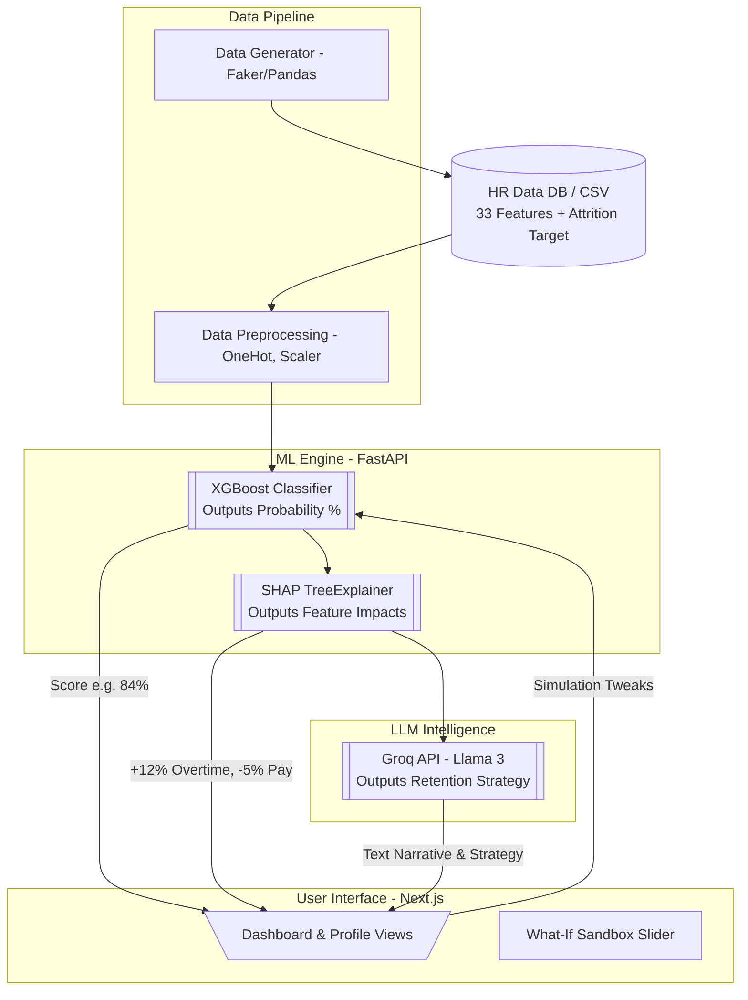

# Generative HR Attrition Insight Reporter: Full System Replication Guide

This document is a comprehensive, step-by-step technical blueprint. It is designed so that *any* AI Agent or software engineering team can read it and perfectly replicate the Generative HR Attrition Insight Reporter system from scratch.

---

## Part 1: System Overview & Architecture Diagram

### The Goal
Build a 3-tier system that takes internal HR data, predicts if an employee will leave (using XGBoost), explains exactly *why* mathematically (using SHAP), and generates an actionable retention strategy in plain English (using the Groq LLM API). 

### Architecture Flow



### Essential Tech Stack
| Layer | Technology | Purpose |
|:---|:---|:---|
| **Language** | Python 3.10+ | All backend logic |
| **Data Processing** | `pandas`, `numpy` | DataFrame operations, synthetic data generation |
| **ML Model** | `xgboost` | Binary classification for attrition prediction |
| **Explainability** | `shap` | SHAP TreeExplainer for feature importance |
| **Preprocessing** | `scikit-learn` | `ColumnTransformer`, `StandardScaler`, `OneHotEncoder` |
| **Serialization** | `joblib` | Persist trained model & preprocessor to disk |
| **API Server** | `fastapi`, `uvicorn` | Async REST API |
| **Validation** | `pydantic` | Request/Response schemas |
| **GenAI** | `groq` (Python SDK) | LLM inference via Groq cloud |
| **Frontend** | Next.js 14+ (App Router) | React-based dashboard |
| **Styling** | `tailwindcss` | Utility-first CSS |
| **Charts** | `recharts` | SHAP visualizations, risk gauges |

---

## Part 2: Project Directory Structure

The project is organized as a monorepo with two independent applications (backend and frontend) sharing a root.

```
HR/
├── doc.md                          # This file
├── backend/
│   ├── .env                        # Environment variables (GROQ_API_KEY)
│   ├── requirements.txt            # Python dependencies
│   ├── main.py                     # FastAPI app entry point, CORS, routers
│   ├── config.py                   # Settings loaded from .env via pydantic-settings
│   ├── database.py                 # Data loading (CSV/SQLite) and query helpers
│   ├── models/
│   │   ├── schemas.py              # Pydantic request/response models
│   ├── ml/
│   │   ├── generate_data.py        # Synthetic dataset generator script
│   │   ├── train_pipeline.py       # Model training & export script
│   │   ├── predictor.py            # Runtime inference + SHAP explanation logic
│   │   ├── hr_dataset.csv          # Generated synthetic data (gitignored if large)
│   │   ├── xgb_model.joblib        # Serialized trained XGBoost model
│   │   └── preprocessor.joblib     # Serialized sklearn ColumnTransformer
│   ├── services/
│   │   ├── ai_service.py           # Groq LLM prompt construction & invocation
│   │   └── dashboard_service.py    # Aggregation logic for dashboard KPIs
│   ├── routers/
│   │   ├── employees.py            # /api/employees routes
│   │   └── dashboard.py            # /api/dashboard routes
│   └── tests/
│       ├── test_predictor.py       # Unit tests for ML inference
│       ├── test_endpoints.py       # Integration tests for API routes
│       └── test_ai_service.py      # Mocked Groq response tests
│
├── frontend/
│   ├── package.json
│   ├── next.config.js
│   ├── tailwind.config.ts
│   ├── .env.local                  # NEXT_PUBLIC_API_URL=http://localhost:8000
│   ├── src/
│   │   ├── app/
│   │   │   ├── layout.tsx          # Root layout (fonts, global styles)
│   │   │   ├── page.tsx            # Dashboard home
│   │   │   └── employees/
│   │   │       ├── page.tsx        # Employee directory
│   │   │       └── [id]/
│   │   │           └── page.tsx    # Individual risk profile
│   │   ├── components/
│   │   │   ├── KPICard.tsx         # Reusable metric card
│   │   │   ├── RiskGauge.tsx       # Circular risk score gauge
│   │   │   ├── SHAPChart.tsx       # Horizontal bar chart for SHAP values
│   │   │   ├── InsightPanel.tsx    # Renders Groq narrative text
│   │   │   ├── SimulationSandbox.tsx # What-If sliders + live score
│   │   │   ├── EmployeeTable.tsx   # Data grid with filters
│   │   │   └── DeptRiskChart.tsx   # Bar chart for department risks
│   │   └── lib/
│   │       └── api.ts              # Centralized fetch/axios client
│   └── public/
│       └── ...                     # Static assets
```

---

## Part 3: Environment Configuration

### Backend `.env`
```env
# Required
GROQ_API_KEY=gsk_xxxxxxxxxxxxxxxxxxxx
GROQ_MODEL=llama3-8b-8192

# Optional (defaults shown)
DATA_PATH=ml/hr_dataset.csv
MODEL_PATH=ml/xgb_model.joblib
PREPROCESSOR_PATH=ml/preprocessor.joblib
CORS_ORIGINS=http://localhost:3000
```

### Backend `config.py`
```python
from pydantic_settings import BaseSettings

class Settings(BaseSettings):
    groq_api_key: str
    groq_model: str = "llama3-8b-8192"
    data_path: str = "ml/hr_dataset.csv"
    model_path: str = "ml/xgb_model.joblib"
    preprocessor_path: str = "ml/preprocessor.joblib"
    cors_origins: str = "http://localhost:3000"

    class Config:
        env_file = ".env"

settings = Settings()
```

### Frontend `.env.local`
```env
NEXT_PUBLIC_API_URL=http://localhost:8000
```

---

## Part 4: The Data Schema Definition

The foundation of the ML model is a 35-column dataset. An agent building this must ensure the training data strictly adheres to these columns.

### 4.1 Input Features (33 Columns)
*The Agent must encode categorical variables and scale numerical ones during preprocessing.*

| # | Category | Column Name | Type | Range / Values | ML Notes |
|:--|:---|:---|:---|:---|:---|
| 1 | Identity | `EmployeeID` | String | "E0001" - "E9999" | **Dropped before training** |
| 2 | | `Age` | Int | 18 - 65 | Continuous, scale |
| 3 | | `Gender` | Cat | Male, Female, Non-binary | OneHotEncode |
| 4 | | `MaritalStatus` | Cat | Single, Married, Divorced | OneHotEncode |
| 5 | Education | `Education` | Ordinal | 1 (Below College) → 5 (Doctorate) | Treat as numeric |
| 6 | | `EducationField` | Cat | IT, HR, Marketing, Life Sciences, Medical, Other | OneHotEncode |
| 7 | Job | `Department` | Cat | Sales, R&D, HR, IT, Finance | OneHotEncode |
| 8 | | `JobRole` | Cat | Developer, Manager, Analyst, Executive, HR Rep, Scientist | OneHotEncode |
| 9 | | `JobLevel` | Ordinal | 1 (Entry) → 5 (Director) | Treat as numeric |
| 10 | | `BusinessTravel` | Cat | Non-Travel, Rarely, Frequently | OneHotEncode |
| 11 | | `OverTime` | Binary | Yes, No | **Top predictor** — map to 1/0 |
| 12 | | `DistanceFromHome` | Int | 1 - 100 (km) | Continuous, scale |
| 13 | Comp | `MonthlyIncome` | Int | 15,000 - 200,000 | Continuous, scale |
| 14 | | `PercentSalaryHike` | Int | 0 - 25 (%) | Continuous, scale |
| 15 | | `StockOptionLevel` | Ordinal | 0 (None) → 3 (High) | Treat as numeric |
| 16 | | `MonthlyRate` | Int | 2,000 - 25,000 | Continuous, scale |
| 17 | Tenure | `TotalWorkingYears` | Int | 0 - 40 | Continuous, scale |
| 18 | | `YearsAtCompany` | Int | 0 - 30 | Continuous, scale |
| 19 | | `YearsInCurrentRole` | Int | 0 - 20 | Continuous, scale |
| 20 | | `YearsSinceLastPromotion` | Int | 0 - 15 | **Top predictor** |
| 21 | | `YearsWithCurrManager` | Int | 0 - 17 | Continuous, scale |
| 22 | | `NumCompaniesWorked` | Int | 0 - 10 | Continuous, scale |
| 23 | | `TrainingTimesLastYear` | Int | 0 - 6 | Continuous, scale |
| 24 | Satisfaction | `JobSatisfaction` | Ordinal | 1 (Low) → 4 (Very High) | Treat as numeric |
| 25 | | `EnvironmentSatisfaction` | Ordinal | 1 → 4 | Treat as numeric |
| 26 | | `RelationshipSatisfaction` | Ordinal | 1 → 4 | Treat as numeric |
| 27 | | `WorkLifeBalance` | Ordinal | 1 (Bad) → 4 (Best) | Treat as numeric |
| 28 | | `JobInvolvement` | Ordinal | 1 → 4 | Treat as numeric |
| 29 | | `PerformanceRating` | Ordinal | 1 (Low) → 4 (Outstanding) | Treat as numeric |
| 30 | Wellness | `SickLeaveDaysLastYear` | Int | 0 - 30 | Continuous, scale |
| 31 | | `AbsenteeismRate` | Float | 0.0 - 20.0 (%) | Continuous, scale |
| 32 | | `TeamSize` | Int | 3 - 25 | Continuous, scale |
| 33 | | `ManagerFeedbackScore` | Ordinal | 1 → 5 | Treat as numeric |

### 4.2 Target & Engineered Columns
| Column Name | Type | Generated By | Description |
|:---|:---|:---|:---|
| `Attrition` | Binary (Yes/No) | Data Generator | The ground truth label. Used **only** during model training. |
| `Composite_Satisfaction` | Float | Feature Engineering | `mean(JobSatisfaction, EnvironmentSatisfaction, RelationshipSatisfaction, WorkLifeBalance, JobInvolvement)`. Recommended composite feature for the model. |

### 4.3 Runtime Output Columns (Not in CSV — computed at request time)
| Column Name | Type | Generated By | Description |
|:---|:---|:---|:---|
| `AttritionRiskScore` | Float (0-100) | XGBoost `predict_proba` | The probability of attrition. |
| `RiskTier` | Categorical | Simple Math | `High` (>70%), `Medium` (40-70%), `Low` (<40%) |
| `TopRiskFactors` | List[dict] | SHAP Explainer | Top 5 features driving the score up or down. |
| `InsightReport` | String | Groq LLM | Executive summary of the risk pattern. |
| `RetentionStrategies` | List[String] | Groq LLM | 3 actionable interventions for the manager. |

---

## Part 5: Synthetic Data Generation Rules

The data generator (`generate_data.py`) must embed **realistic statistical correlations** so the XGBoost model learns meaningful patterns rather than noise.

### 5.1 Critical Correlation Rules to Hardcode

| Rule | Logic | Rationale |
|:---|:---|:---|
| **Overtime + Low Hike → High Attrition** | If `OverTime == "Yes"` AND `PercentSalaryHike < 8`: set `Attrition = "Yes"` with ~70% probability | Industry's #1 attrition driver |
| **Stagnation → High Attrition** | If `YearsSinceLastPromotion >= 4` AND `JobLevel <= 2`: `Attrition = "Yes"` with ~60% probability | Career stagnation in junior roles |
| **Low Satisfaction Cluster → High Attrition** | If `JobSatisfaction <= 2` AND `EnvironmentSatisfaction <= 2`: `Attrition = "Yes"` with ~55% probability | Compound dissatisfaction |
| **High Income + High Satisfaction → Low Attrition** | If `MonthlyIncome > 80000` AND `JobSatisfaction >= 3`: `Attrition = "No"` with ~90% probability | Golden handcuffs |
| **Long Commute + Overtime → High Attrition** | If `DistanceFromHome > 25` AND `OverTime == "Yes"`: `Attrition = "Yes"` with ~65% probability | Burnout + logistics |
| **Poor Manager → High Attrition** | If `ManagerFeedbackScore <= 2` AND `YearsWithCurrManager >= 3`: `Attrition = "Yes"` with ~50% probability | "People leave managers" |

### 5.2 Class Balance Target
- **Attrition = "Yes"**: ~16-20% of total rows (matching real-world corporate attrition rates).
- **Attrition = "No"**: ~80-84% of total rows.
- This imbalance is intentional and must be handled via `scale_pos_weight` during XGBoost training.

### 5.3 Sample Row (What 1 Generated Record Looks Like)
```
EmployeeID:               E0042
Age:                       29
Gender:                    Male
MaritalStatus:             Single
Education:                 3 (Bachelor)
EducationField:            IT
Department:                R&D
JobRole:                   Developer
JobLevel:                  2
BusinessTravel:            Frequently
OverTime:                  Yes          ← Red flag
DistanceFromHome:          34           ← Red flag
MonthlyIncome:             42000
PercentSalaryHike:         5            ← Red flag
StockOptionLevel:          0
MonthlyRate:               8000
TotalWorkingYears:         6
YearsAtCompany:            2
YearsInCurrentRole:        1
YearsSinceLastPromotion:   2
YearsWithCurrManager:      1
NumCompaniesWorked:        3
TrainingTimesLastYear:     1
JobSatisfaction:           2            ← Red flag
EnvironmentSatisfaction:   1            ← Red flag
RelationshipSatisfaction:  2
WorkLifeBalance:           2
JobInvolvement:            2
PerformanceRating:         3
SickLeaveDaysLastYear:     8
AbsenteeismRate:           6.2
TeamSize:                  12
ManagerFeedbackScore:      2            ← Red flag
───────────────────────────────────────
Attrition:                 Yes          ← Ground Truth
```

---

## Part 6: ML Pipeline Specification

### 6.1 Preprocessing (`ColumnTransformer`)

```python
from sklearn.compose import ColumnTransformer
from sklearn.preprocessing import StandardScaler, OneHotEncoder

# Define column groups
NUMERIC_COLS = [
    'Age', 'DistanceFromHome', 'MonthlyIncome', 'PercentSalaryHike',
    'MonthlyRate', 'TotalWorkingYears', 'YearsAtCompany',
    'YearsInCurrentRole', 'YearsSinceLastPromotion',
    'YearsWithCurrManager', 'NumCompaniesWorked',
    'TrainingTimesLastYear', 'SickLeaveDaysLastYear',
    'AbsenteeismRate', 'TeamSize',
    # Ordinals treated as numeric:
    'Education', 'JobLevel', 'StockOptionLevel',
    'JobSatisfaction', 'EnvironmentSatisfaction',
    'RelationshipSatisfaction', 'WorkLifeBalance',
    'JobInvolvement', 'PerformanceRating', 'ManagerFeedbackScore'
]

CATEGORICAL_COLS = [
    'Gender', 'MaritalStatus', 'EducationField',
    'Department', 'JobRole', 'BusinessTravel', 'OverTime'
]

# Columns to DROP before training
DROP_COLS = ['EmployeeID']

preprocessor = ColumnTransformer(transformers=[
    ('num', StandardScaler(), NUMERIC_COLS),
    ('cat', OneHotEncoder(handle_unknown='ignore', sparse_output=False), CATEGORICAL_COLS)
])
```

### 6.2 Model Training

```python
import xgboost as xgb
from sklearn.model_selection import train_test_split
from sklearn.metrics import classification_report, roc_auc_score

# Load and prepare
df = pd.read_csv('hr_dataset.csv')
X = df.drop(columns=['EmployeeID', 'Attrition'])
y = df['Attrition'].map({'Yes': 1, 'No': 0})

X_train, X_test, y_train, y_test = train_test_split(X, y, test_size=0.2, stratify=y)

# Calculate class weight
scale_pos = (y_train == 0).sum() / (y_train == 1).sum()

# Preprocess
X_train_processed = preprocessor.fit_transform(X_train)
X_test_processed = preprocessor.transform(X_test)

# Train
model = xgb.XGBClassifier(
    n_estimators=200,
    max_depth=5,
    learning_rate=0.1,
    eval_metric='logloss',
    scale_pos_weight=scale_pos,  # Handle class imbalance
    use_label_encoder=False
)
model.fit(X_train_processed, y_train)

# Evaluate — PRIORITIZE RECALL
y_pred = model.predict(X_test_processed)
y_proba = model.predict_proba(X_test_processed)[:, 1]

print(classification_report(y_test, y_pred))
print(f"ROC-AUC: {roc_auc_score(y_test, y_proba):.4f}")

# Serialize
joblib.dump(model, 'xgb_model.joblib')
joblib.dump(preprocessor, 'preprocessor.joblib')
```

### 6.3 SHAP Explanation Logic (`predictor.py`)

```python
import shap
import numpy as np

def explain_prediction(model, preprocessor, employee_row_df):
    """
    Takes a single employee's raw features (as a 1-row DataFrame),
    preprocesses them, runs XGBoost inference, and extracts SHAP explanations.

    Returns:
        risk_score: float (0-100)
        risk_tier: str ("High", "Medium", "Low")
        top_factors: list[dict] e.g. [{"feature": "OverTime", "value": "Yes", "impact": "+14.2%"}]
    """
    # Preprocess
    X_processed = preprocessor.transform(employee_row_df)

    # Predict
    risk_score = float(model.predict_proba(X_processed)[0][1]) * 100

    # Tier assignment
    if risk_score > 70:
        risk_tier = "High"
    elif risk_score > 40:
        risk_tier = "Medium"
    else:
        risk_tier = "Low"

    # SHAP
    explainer = shap.TreeExplainer(model)
    shap_values = explainer.shap_values(X_processed)

    # Map SHAP values back to feature names
    feature_names = preprocessor.get_feature_names_out()
    shap_dict = dict(zip(feature_names, shap_values[0]))

    # Sort by absolute impact and take top 5
    sorted_factors = sorted(shap_dict.items(), key=lambda x: abs(x[1]), reverse=True)[:5]

    top_factors = []
    for feat_name, impact in sorted_factors:
        # Clean up OneHotEncoded names (e.g., "cat__OverTime_Yes" → "OverTime=Yes")
        clean_name = feat_name.replace("num__", "").replace("cat__", "").replace("_", "=", 1)
        direction = "+" if impact > 0 else "-"
        top_factors.append({
            "feature": clean_name,
            "impact": f"{direction}{abs(impact):.1%}"
        })

    return risk_score, risk_tier, top_factors
```

---

## Part 7: Pydantic Request/Response Models (`schemas.py`)

These models enforce strict typing across the API.

```python
from pydantic import BaseModel

# --- Dashboard ---
class DashboardSummary(BaseModel):
    active_headcount: int
    avg_risk_score: float
    high_risk_count: int
    medium_risk_count: int
    low_risk_count: int
    avg_tenure: float
    estimated_turnover_cost: float  # high_risk_count * avg_salary * 0.5

class DepartmentRisk(BaseModel):
    department: str
    avg_risk_score: float
    employee_count: int

# --- Employee ---
class EmployeeBase(BaseModel):
    employee_id: str
    age: int
    department: str
    job_role: str
    job_level: int
    monthly_income: int
    performance_rating: int
    years_at_company: int
    risk_score: float | None = None
    risk_tier: str | None = None

class EmployeeDetail(EmployeeBase):
    gender: str
    marital_status: str
    education: int
    education_field: str
    business_travel: str
    over_time: str
    distance_from_home: int
    percent_salary_hike: int
    stock_option_level: int
    total_working_years: int
    years_in_current_role: int
    years_since_last_promotion: int
    years_with_curr_manager: int
    num_companies_worked: int
    training_times_last_year: int
    job_satisfaction: int
    environment_satisfaction: int
    relationship_satisfaction: int
    work_life_balance: int
    job_involvement: int
    sick_leave_days_last_year: int
    absenteeism_rate: float
    team_size: int
    manager_feedback_score: int

# --- Analysis ---
class RiskDriver(BaseModel):
    feature: str
    impact: str  # e.g., "+14.2%"

class MLAnalysis(BaseModel):
    risk_score: float
    risk_tier: str
    top_drivers: list[RiskDriver]

class AIInsights(BaseModel):
    risk_narrative: str
    retention_strategies: list[str]

class FullAnalysisResponse(BaseModel):
    employee_id: str
    ml_analysis: MLAnalysis
    ai_insights: AIInsights

# --- Simulation ---
class SimulationRequest(BaseModel):
    """Only include fields the user wants to change."""
    monthly_income: int | None = None
    percent_salary_hike: int | None = None
    over_time: str | None = None           # "Yes" or "No"
    job_level: int | None = None
    work_life_balance: int | None = None
    distance_from_home: int | None = None
    years_since_last_promotion: int | None = None

class SimulationResponse(BaseModel):
    original_risk_score: float
    new_risk_score: float
    delta: float                           # new - original (negative = improvement)
```

---

## Part 8: The Groq System Prompt Template

Agents must use this exact structure to ensure useful, deterministic outputs from the LLM.

```text
You are an expert HR Business Partner and Retention Strategist.

EMPLOYEE CONTEXT:
Name: {EmployeeID}
Job Role: {JobRole} in {Department}
Job Level: {JobLevel}/5 | Tenure: {YearsAtCompany} years
Base Salary: ₹{MonthlyIncome} | Last Hike: {PercentSalaryHike}%
Performance: {PerformanceRating}/4 | Work-Life Balance: {WorkLifeBalance}/4
Overtime: {OverTime} | Distance from Home: {DistanceFromHome} km

PREDICTIVE ML DIAGNOSIS:
Current Flight Risk: {RiskScore}% ({RiskTier})

THE "WHY" (Mathematical Risk Drivers from SHAP):
The Machine Learning model specifically identified these factors as the primary
reasons pushing this employee's risk score higher:
{SHAP_Top_Risk_Factors_Formatted}

TASK:
Provide a concise, 2-section response. Do not use filler introductions.
Use specific numbers from the context above.

1. "Risk Narrative": A 2-3 sentence executive summary explaining the risk
   situation based ONLY on the provided metrics and SHAP drivers.
   Start directly with the analysis.

2. "Retention Strategy": A bulleted list of exactly 3 highly specific,
   actionable, and cost-effective interventions a manager should take
   immediately. Each intervention MUST directly address one of the SHAP
   drivers listed above. Avoid generic advice like "improve communication"
   or "offer a raise" unless a specific SHAP driver supports it.
```

### Groq SDK Invocation Pattern

```python
from groq import Groq

client = Groq(api_key=settings.groq_api_key)

def generate_insights(prompt: str) -> dict:
    response = client.chat.completions.create(
        model=settings.groq_model,
        messages=[
            {"role": "system", "content": "You are an expert HR strategist. Respond in valid JSON with keys: risk_narrative (string), retention_strategies (array of 3 strings)."},
            {"role": "user", "content": prompt}
        ],
        temperature=0.4,       # Low temp for consistency
        max_tokens=600,
        response_format={"type": "json_object"}
    )
    return json.loads(response.choices[0].message.content)
```

---

## Part 9: API Endpoint Specifications

### `GET /api/dashboard/summary`
- **Purpose**: Global KPIs for the dashboard home.
- **Logic**: Run batch `predict_proba` on all employees, aggregate counts by tier.
- **Response**: `DashboardSummary`
- **Caching**: Cache result for 5 minutes (data doesn't change frequently).

### `GET /api/dashboard/department-risks`
- **Purpose**: Risk breakdown by department for bar chart.
- **Response**: `list[DepartmentRisk]`

### `GET /api/employees?skip=0&limit=20&department=R&D&risk_tier=High`
- **Purpose**: Paginated employee directory with filters.
- **Response**: `{ "employees": list[EmployeeBase], "total": int }`

### `GET /api/employees/{id}`
- **Purpose**: Full detail view for a single employee (no ML, just raw data).
- **Response**: `EmployeeDetail`

### `POST /api/employees/{id}/analyze`
- **Purpose**: The heavy lifter. Runs XGBoost → SHAP → Groq LLM.
- **Latency**: ~2-4 seconds (dominated by LLM call).
- **Response**: `FullAnalysisResponse`
- **Caching**: Cache LLM results for 1 hour per employee.

### `POST /api/employees/{id}/simulate`
- **Purpose**: What-If sandbox. Runs only XGBoost (no SHAP, no LLM).
- **Latency**: <200ms (pure model inference).
- **Body**: `SimulationRequest`
- **Response**: `SimulationResponse`

---

## Part 10: Frontend Construction (Next.js)

### 10.1 Route: `page.tsx` (Global Dashboard)

| Component | Data Source | Visual |
|:---|:---|:---|
| 4x KPI Cards | `GET /api/dashboard/summary` | Active Headcount, Avg Flight Risk %, High-Risk Count, Avg Tenure |
| Department Risk Chart | `GET /api/dashboard/department-risks` | `recharts` BarChart, color-coded by risk |
| "Urgent Action" Table | `GET /api/employees?risk_tier=High&limit=5` | Sorted by risk score descending. Each row clickable → `/employees/[id]` |

### 10.2 Route: `employees/page.tsx` (Directory)

| Component | Behavior |
|:---|:---|
| Search Bar | Client-side filter by name/ID |
| Department Filter | Dropdown, calls API with `?department=X` |
| Risk Tier Filter | Toggle buttons (All / High / Medium / Low) |
| Data Table Columns | ID, Name, Role, Dept, Performance (stars), Risk Tier (colored badge) |
| Row Click | Navigates to `/employees/[id]` |

### 10.3 Route: `employees/[id]/page.tsx` (The Intelligence Profile)

This is the **core deliverable** of the entire system. It renders 4 visual blocks:

#### Block 1: The Diagnostic Gauge
- A circular progress bar showing the 0-100% `AttritionRiskScore`.
- Color transitions: Green (<40%) → Yellow (40-70%) → Red (>70%).
- The `RiskTier` label (e.g., "HIGH RISK") displayed prominently below.

#### Block 2: The "Why" Breakdown (SHAP)
- A horizontal bar chart using `recharts`.
- Bars extend left (negative impact = reduces risk) or right (positive = increases risk).
- Each bar labeled with the feature name and value.

#### Block 3: The AI Prescription
- A visually distinct card (e.g., gradient border, subtle glow).
- `risk_narrative` rendered as a paragraph.
- `retention_strategies` rendered as a numbered list.
- A "Regenerate" button to re-call `/analyze` for a fresh LLM response.

#### Block 4: The "What-If" Sandbox
- **Slider Inputs** for: `PercentSalaryHike` (0-25), `WorkLifeBalance` (1-4), `DistanceFromHome` (1-100), `YearsSinceLastPromotion` (0-15).
- **Toggle** for: `OverTime` (Yes/No).
- **Dropdown** for: `JobLevel` (1-5).
- On input change (debounced 300ms), call `POST /api/employees/{id}/simulate`.
- Display: "Current Score: 84%" alongside "Projected Score: 42%" with a delta indicator.

---

## Part 11: Error Handling & Edge Cases

### Backend Error Strategy
| Scenario | Handling |
|:---|:---|
| Employee ID not found | Return `404` with `{"detail": "Employee {id} not found"}` |
| Groq API key missing/invalid | Return `503` with `{"detail": "AI service unavailable"}`, log error server-side |
| Groq rate limited | Implement retry with exponential backoff (max 3 retries) |
| Groq returns malformed JSON | Catch `json.JSONDecodeError`, return `500` with fallback: `{"risk_narrative": "Unable to generate insights. Please retry.", "retention_strategies": []}` |
| Model `.joblib` file missing | Fail loudly on startup with a clear error message. Do not start the server. |
| Simulation with invalid field value | Pydantic validation will auto-reject with `422 Unprocessable Entity` |

### Frontend Error Strategy
| Scenario | Handling |
|:---|:---|
| API unreachable | Show a toast notification: "Backend unavailable. Please ensure the server is running." |
| `/analyze` takes > 5 seconds | Show a skeleton loader with "Generating AI insights..." text |
| `/simulate` fails | Revert slider to previous value, show error toast |

---

## Part 12: Testing Strategy

### Backend Unit Tests (`pytest`)
| Test | What It Validates |
|:---|:---|
| `test_data_schema` | Generated CSV has exactly 35 columns with correct types |
| `test_model_loads` | `.joblib` files load without error |
| `test_prediction_range` | `predict_proba` output is always between 0.0 and 1.0 |
| `test_shap_output_length` | SHAP returns exactly 5 top factors |
| `test_risk_tier_logic` | Score of 85 → "High", 50 → "Medium", 20 → "Low" |
| `test_simulation_delta` | Changing `OverTime` from Yes→No reduces the score |
| `test_groq_prompt_format` | Prompt string contains all required placeholders |

### Backend Integration Tests (`TestClient`)
| Test | What It Validates |
|:---|:---|
| `test_dashboard_summary_200` | `/api/dashboard/summary` returns 200 with correct schema |
| `test_employees_pagination` | `/api/employees?skip=0&limit=5` returns exactly 5 results |
| `test_employee_not_found` | `/api/employees/INVALID` returns 404 |
| `test_analyze_response_schema` | `/api/employees/E0001/analyze` matches `FullAnalysisResponse` |
| `test_simulate_response_schema` | `/api/employees/E0001/simulate` matches `SimulationResponse` |

### Run Command
```bash
cd backend
pytest tests/ -v --tb=short
```

---

## Part 13: Deployment Guide

### Local Development
```bash
# Terminal 1: Backend
cd backend
python -m venv venv
venv\Scripts\activate          # Windows
pip install -r requirements.txt
python ml/generate_data.py     # Step 1: Generate dataset
python ml/train_pipeline.py    # Step 2: Train model
uvicorn main:app --reload --port 8000

# Terminal 2: Frontend
cd frontend
npm install
npm run dev                    # Runs on http://localhost:3000
```

### Production (Docker Compose)
```yaml
# docker-compose.yml
version: "3.9"
services:
  backend:
    build: ./backend
    ports:
      - "8000:8000"
    env_file:
      - ./backend/.env
    volumes:
      - ./backend/ml:/app/ml

  frontend:
    build: ./frontend
    ports:
      - "3000:3000"
    environment:
      - NEXT_PUBLIC_API_URL=http://backend:8000
    depends_on:
      - backend
```

### Backend Dockerfile
```dockerfile
FROM python:3.11-slim
WORKDIR /app
COPY requirements.txt .
RUN pip install --no-cache-dir -r requirements.txt
COPY . .
CMD ["uvicorn", "main:app", "--host", "0.0.0.0", "--port", "8000"]
```

---

## Part 14: Execution Checklist for the Next Agent

If you are an AI Agent tasked with executing this blueprint, follow this exact sequence:

- [ ] **Step 1**: Create the `backend/` directory structure as shown in Part 2.
- [ ] **Step 2**: Create `requirements.txt` with: `fastapi uvicorn pandas numpy scikit-learn xgboost shap groq joblib pydantic-settings python-dotenv`.
- [ ] **Step 3**: Create `.env` with the `GROQ_API_KEY`.
- [ ] **Step 4**: Write `generate_data.py` following Part 5 correlation rules. Generate 2,000 rows. Verify the CSV has 35 columns and ~16-20% attrition rate.
- [ ] **Step 5**: Write `train_pipeline.py` following Part 6. Train the model. Verify ROC-AUC > 0.75. Save `.joblib` files.
- [ ] **Step 6**: Write `predictor.py` following Part 6.3.
- [ ] **Step 7**: Write `schemas.py` following Part 7.
- [ ] **Step 8**: Write `ai_service.py` following Part 8.
- [ ] **Step 9**: Write `main.py` and routers following Part 9. Start the server, test all endpoints.
- [ ] **Step 10**: Initialize Next.js in `frontend/`. Install `tailwindcss`, `recharts`.
- [ ] **Step 11**: Build the Dashboard page (Part 10.1).
- [ ] **Step 12**: Build the Employee Directory (Part 10.2).
- [ ] **Step 13**: Build the Employee Intelligence Profile with all 4 blocks (Part 10.3).
- [ ] **Step 14**: Run all tests (Part 12). Fix any failures.
- [ ] **Step 15**: Verify the full end-to-end flow: Dashboard → Click Employee → View Analysis → Use Sandbox.

> **CRITICAL**: Do not skip steps. Do not proceed to Step 6 until Step 5 produces valid `.joblib` files. Do not start the frontend until all backend endpoints return valid responses.
